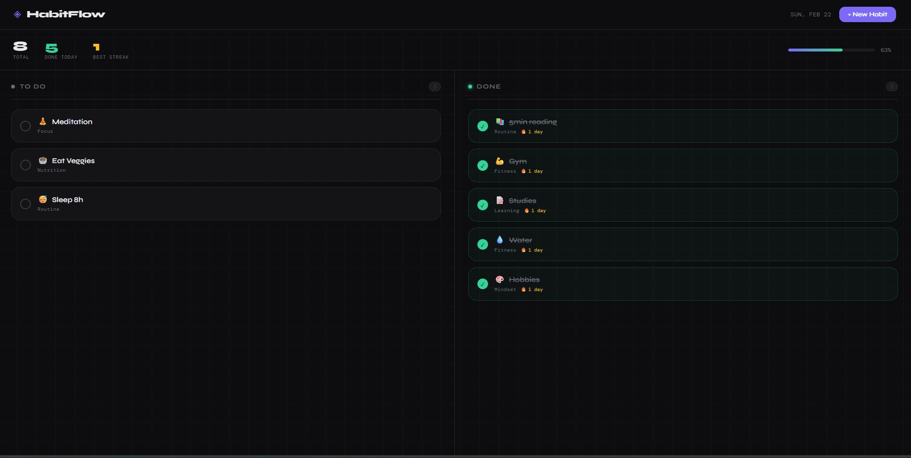

HabitFlow — Daily Habit Tracker
A kanban-based habit tracker with automatic streak tracking, built with vanilla JS and zero dependencies.

> Personal portfolio project by Matheus Ramos. This demonstrates practical browser development and problem-solving; it is not presented as professional client experience.

🔗 Live Demo
👉 https://math2034.github.io/Habit-Tracker/

Screenshots

🚀 Features

Create new habits
Edit existing habits
Delete habits
Mark habits as completed
Automatic streak tracking
Dynamic habit counter
Data persistence with LocalStorage
Clean and responsive UI

🛠 Technologies Used

HTML5
CSS3 (Grid, Flexbox, Custom Properties)
JavaScript (ES6+)
LocalStorage API

🧠 Key Concepts Practiced

DOM manipulation
Event handling
State management using arrays of objects
Dynamic rendering of UI elements
Streak calculation using date history traversal
Kanban state separation (todo/done)
Data persistence in browser storage
Clean project structure

📦 Project Structure
habit-tracker/
│
├── index.html
├── style.css
├── script.js
├── assets/
│   └── screenshots/
└── README.txt

📈 Future Improvements

Add drag-and-drop functionality
Implement due dates and priorities
Category filtering
Weekly progress chart
Add backend integration (Node.js + Database)

👤 Author
Matheus Ramos
IT student building practical front-end projects
Based in Perth, Australia

GitHub: https://github.com/Math2034

